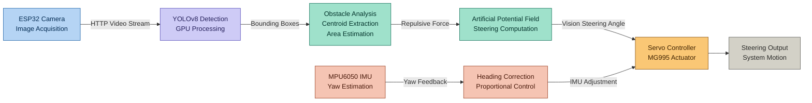
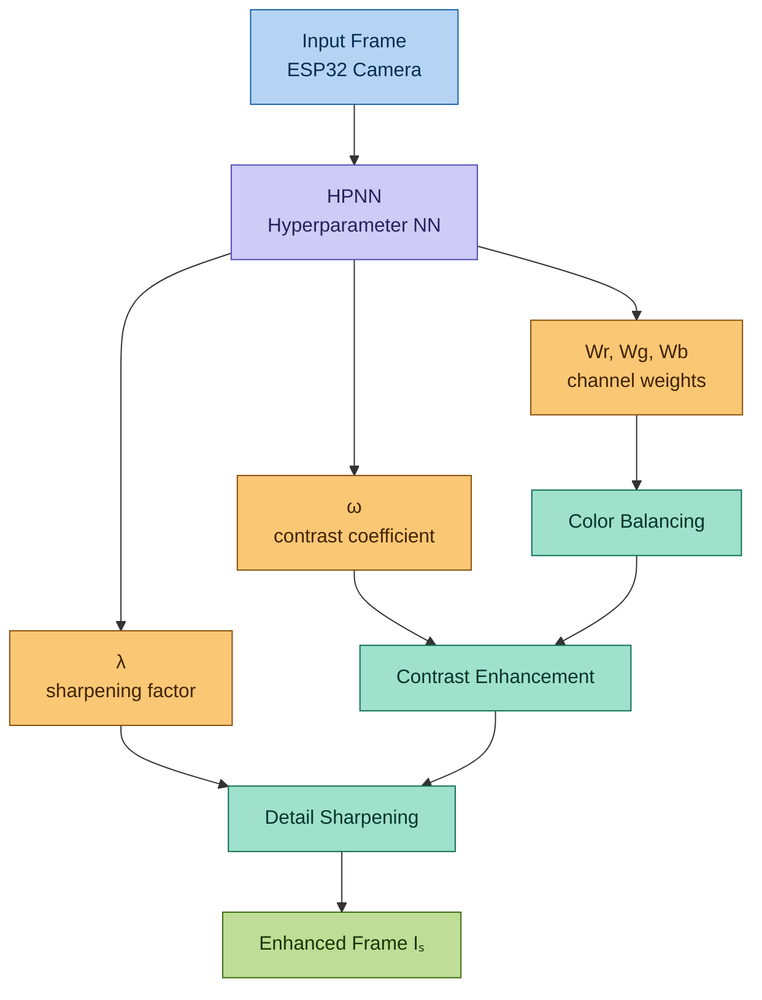
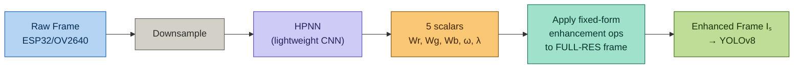

# Vision-based Obstacle Tracking and IMU for Robotic Fish Steering Navigation

<div align="center">

[](https://www.python.org/)
[](https://pytorch.org/)
[](https://github.com/ultralytics/ultralytics)
[](https://www.espressif.com/en/products/socs/esp32)
[](LICENSE)

**Amrita School of Artificial Intelligence | Amrita Vishwa Vidyapeetham**

</div>


## Table of Contents

1. [Introduction & Motivation](#1-introduction--motivation)
2. [Problem Statement](#2-problem-statement)
4. [System Architecture](#4-system-architecture)
5. [Hardware Platform](#5-hardware-platform)
6. [Adaptive Image Enhancement (AIE) Module](#6-adaptive-image-enhancement-aie-module)
7. [Obstacle Detection with YOLOv8](#7-obstacle-detection-with-yolov8)
8. [Distance Estimation](#8-distance-estimation)
9. [Navigation & Control Design](#9-navigation--control-design)
10. [Navigation Algorithm](#10-navigation-algorithm)
11. [Methodology & Dataset](#11-methodology--dataset)
12. [Experimental Validation](#12-experimental-validation)
13. [Control & Navigation Parameters](#13-control--navigation-parameters)


---

## 1. Introduction & Motivation

Autonomous underwater navigation is hard. Turbid water, unpredictable lighting, and constant water movement work against both **perception** (cameras struggle to see clearly) and **balance** (currents push the robot off course).

> This project builds a robotic fish that **sees** obstacles through an enhanced-vision pipeline and **feels** its own drift through an inertial sensor — fusing both into a single steering decision.

Two well-known building blocks are combined:

- **Vision-based obstacle avoidance** — proven in robotic fish formation-control work, but prone to drift from actuation delay and disturbances when used alone.
- **Vision-inertial odometry** — a well-established sensor-fusion approach where IMU orientation data corrects oscillation and drift that vision alone cannot fix.

The **MPU6050** (a compact 6-DOF MEMS IMU: 3-axis accelerometer + 3-axis gyroscope) supplies the inertial half. **YOLOv8** supplies the vision half, chosen for its balance of detection accuracy and real-time inference speed.

---

## 2. Problem Statement

```
Underwater Camera Feed
         |
  Scattering, dimming, desaturation (particles + wavelength loss)
  Poor, inconsistent lighting
  Nonlinear hydrodynamic drift
         |
  Vision-only steering drifts & oscillates
  IMU-only steering has no obstacle awareness
         |
  NEED: a single closed-loop system that sees AND stays on-heading
```

### The Challenge

- Underwater images suffer color loss (wavelength-dependent) and scattering (particle-dependent), which degrades object detection.
- Steering based on vision alone accumulates **heading drift** from servo actuation delay and current disturbances.
- Monocular cameras cannot directly measure depth — distance to obstacles has to be inferred.
- All of this has to run in real time on a **wireless, distributed** perception-control pipeline (lightweight MCU + host GPU).

---


## 4. System Architecture

The system follows a **perception → decision → control** pipeline, with IMU feedback closing the loop:



Deep learning inference (HPNN + YOLOv8) runs on a separate host with a GPU, so the ESP32 only handles image capture, IMU reads, and Wi-Fi transport — keeping the embedded side lightweight.

---

## 5. Hardware Platform

| Component | Role |
|---|---|
| **ESP32 microcontroller** | Wi-Fi communication hub |
| **OV2640 camera** (640×480) | Image acquisition |
| **MPU6050 IMU** | 3-axis accelerometer + 3-axis gyroscope, posture/yaw sensing |
| **MG995 servo motor** | Actuates the tail fin for steering |
| **Host PC/GPU** | Runs HPNN enhancement + YOLOv8 inference + control computation |

The captured frames are transmitted over Wi-Fi from the ESP32 to the host processing unit. Computationally heavy inference is offloaded entirely to the host, keeping the onboard hardware simple.

---

## 6. Adaptive Image Enhancement (AIE) Module

Underwater particles cause scattering, dimming, and desaturation — all of which hurt detection accuracy. Before any detection happens, a portable **HPNN** analyzes each frame and predicts enhancement parameters on the fly.



### What Exactly Is the HPNN?

**HPNN = Hyperparameter Neural Network.** It doesn't output a pixel-by-pixel enhanced image itself — instead it's a small, fast network that looks at a **down-sampled version of the input frame** and predicts just **five scalar numbers** that parameterize the three classical enhancement operations below:

$$\text{HPNN}(I_{\text{downsampled}}) \rightarrow \{W_r,\ W_g,\ W_b,\ \omega,\ \lambda\}$$

| Output | Controls | Used in |
|---|---|---|
| $W_r, W_g, W_b$ | Per-channel color weighting | Color balancing (Eq. 2) |
| $\omega$ | Blend ratio, enhanced vs. original | Contrast enhancement (Eq. 3) |
| $\lambda$ | Edge/detail boost strength | Sharpening (Eq. 4) |

This is a deliberate design choice: predicting **5 numbers** is dramatically cheaper than predicting a full-resolution image, which is what makes it feasible to run frame-by-frame on a live underwater video stream. The actual pixel-level image transformations (color balance, contrast blend, unsharp mask) are plain, well-understood, **fixed formulas** — the HPNN only learns *how much* of each to apply for a given frame.



### Why Train It Jointly With YOLOv8, Not Separately?

A conventional underwater enhancement network is trained against a "clean" reference image (e.g., a color-corrected or dehazed ground truth) — but collecting clean underwater reference images at scale is impractical.

Instead, the HPNN here has **no image-quality loss at all**. It is trained purely so that whatever it outputs makes YOLOv8's **detection loss go down**:

$$\mathcal{L}_{\text{total}} = \mathcal{L}_{\text{YOLOv8-detection}}\big(\ \text{YOLOv8}(\ \text{Enhance}(I,\ \text{HPNN}(I))\ )\ \big)$$

Because every enhancement step (Eqs. 2–4) is a simple differentiable formula, gradients flow backward from the detection loss, through the enhancement math, into the HPNN's own weights. In effect the HPNN learns: *"which color/contrast/sharpness settings make obstacles easiest for YOLOv8 to find,"* rather than *"which settings look most natural to a human."*

### Illustrative Walkthrough

Say a frame arrives with a greenish, low-contrast, slightly blurred cast — typical of murky water. A trained HPNN might predict:

| Parameter | Predicted value | Effect |
|---|---|---|
| $W_r$ | 1.35 | Boosts red (red wavelengths attenuate fastest underwater, so they're the weakest to start with) |
| $W_g$ | 0.90 | Slightly suppresses the dominant green cast |
| $W_b$ | 1.05 | Minor blue boost |
| $\omega$ | 0.7 | Leans strongly toward the contrast-enhanced version |
| $\lambda$ | 2 | Moderate sharpening to recover edges softened by scattering |

These five numbers get plugged into Eqs. 2–4 and applied to the **full-resolution** frame, producing $I_s$, which is what YOLOv8 actually sees. A clearer frame in a different lighting condition might yield a near-identity prediction ($\omega \approx 0$, $\lambda \approx 0$) since little correction is needed.

### Minimal HPNN + Enhancement Code Sketch

```python
import torch
import torch.nn as nn
import torch.nn.functional as F

class HPNN(nn.Module):
    """Predicts 5 enhancement scalars: Wr, Wg, Wb, omega, lambda."""
    def __init__(self):
        super().__init__()
        self.net = nn.Sequential(
            nn.Conv2d(3, 16, 3, stride=2, padding=1), nn.ReLU(),
            nn.Conv2d(16, 32, 3, stride=2, padding=1), nn.ReLU(),
            nn.AdaptiveAvgPool2d(1),
        )
        self.head = nn.Linear(32, 5)

    def forward(self, x_downsampled):
        feat = self.net(x_downsampled).flatten(1)
        params = self.head(feat)
        Wr, Wg, Wb = torch.sigmoid(params[:, 0:3]).unbind(dim=1)  # keep weights in [0,1]-ish range
        omega = torch.sigmoid(params[:, 3])                        # blend ratio in [0, 1]
        lam = F.softplus(params[:, 4])                             # sharpening >= 0
        return Wr, Wg, Wb, omega, lam


def enhance(I, Wr, Wg, Wb, omega, lam):
    """Applies Eqs. 2-4 to full-resolution frame I using HPNN-predicted params."""
    # Step 1: channel-wise color balancing (Eq. 2)
    Iw = torch.stack([I[:, 0] * Wr, I[:, 1] * Wg, I[:, 2] * Wb], dim=1)

    # Step 2: contrast enhancement, En(.) e.g. histogram-equalize / CLAHE-style op (Eq. 3)
    En_Iw = histogram_equalize(Iw)  # placeholder for the enhancement operator
    Ic = omega.view(-1, 1, 1, 1) * En_Iw + (1 - omega.view(-1, 1, 1, 1)) * Iw

    # Step 3: unsharp-mask sharpening (Eq. 4)
    blurred = gaussian_blur(Ic)
    Is = Ic + lam.view(-1, 1, 1, 1) * (Ic - blurred)
    return Is
```

Detection loss is simply backpropagated through `enhance()` and into `HPNN`, so a single optimizer step updates both the detector and the enhancement network together.

---

### The Three Enhancement Steps

**1. Channel-wise Color Balancing**

$$I_w = (W_r I_r,\ W_g I_g,\ W_b I_b)$$

where $I_r, I_g, I_b$ are the RGB channels and $W_r, W_g, W_b$ are per-channel weights generated by the HPNN.

**2. Contrast Enhancement**

$$I_c = \omega\, \text{En}(I) + (1-\omega) I$$

where $\omega$ balances the enhanced image against the original.

**3. Detail Sharpening (unsharp mask)**

$$I_s = I + \lambda\big(I - \text{Gaussian}(I)\big)$$

with sharpness factor $\lambda$.

The final sharpened image $I_s$ is what gets passed to the YOLOv8 detector.

> **Key property:** all three operations are **differentiable**, so detection loss backpropagates straight through the HPNN — it trains jointly with the YOLOv8 backbone, with no need for paired clean/degraded image ground truth.

---

## 7. Obstacle Detection with YOLOv8

- **Backbone:** YOLOv8n (nano) — chosen for the best accuracy-vs-speed tradeoff for embedded/wireless deployment.
- **Initialization:** pretrained on ImageNet, then fine-tuned on the collected underwater dataset.
- **Output:** bounding boxes with corner coordinates $(x_1, y_1, x_2, y_2)$ for each detected obstacle.
- **Decision logic:** obstacles near the image center trigger a stronger avoidance reaction (crashes are most likely to happen dead-ahead); larger bounding boxes (closer obstacles) also increase the avoidance response.
- **Duplicate suppression:** if two bounding-box centers are within 50 pixels horizontally, they're treated as the same obstacle and only one is kept.

**Horizontal displacement of an obstacle from image center:**

$$d_i = \frac{c_i - W/2}{W/2}$$

where $c_i$ is the obstacle's center and $W$ is the image width.

---

## 8. Distance Estimation

Monocular cameras can't measure depth directly, so distance is inferred from **normalized bounding-box area**:

$$A_i = \frac{(x_2-x_1)(y_2-y_1)}{HW}$$

Under a perspective-projection assumption:

$$A_i \propto \frac{1}{D_i^2}$$

where $D_i$ is the distance to the obstacle — the bigger the box, the closer (and more urgent) the obstacle.

---

## 9. Navigation & Control Design

### 9.1 Artificial Potential Field (APF) Navigation

Each obstacle beyond a proximity threshold contributes a repulsive steering force:

$$F_i = \begin{cases} -k_r\, d_i\, (A_i - A_{th}) & A_i > A_{th} \\ 0 & \text{otherwise} \end{cases}$$

where $k_r$ is the repulsion gain, $d_i$ is normalized horizontal displacement, $A_i$ is normalized bounding-box area, and $A_{th}$ is the closeness threshold.

Forces are temporally smoothed over a window of size $N$ to suppress detection noise:

$$F_s = \frac{1}{N}\sum_{k=1}^{N} F_k$$

**Adaptive gain** scales with a rolling risk metric $\bar\rho(t)$ (smoothed obstacle area over the last $M$ frames):

$$G_s(t) = G_0\,(1 + \bar\rho(t)) \qquad \bar\rho(t) = \frac{1}{M}\sum_{k=t-M}^{t}\sum_i A_i^{(k)}$$

Final vision steering angle:

$$\theta_v = \theta_0 + G_s F_s$$

where $\theta_0$ is the servo's neutral angle.

### 9.2 Heading Stabilization Using IMU

The IMU outputs yaw $\psi(t)$; the reference heading $\psi_r = \psi(0)$ is captured at power-on. A **PD controller** corrects drift:

$$e_\psi = \psi_r - \psi(t), \qquad C_{imu} = K_p e_\psi + K_d \dot e_\psi$$

Empirically tuned gains: $K_p = 0.6$, $K_d = 0.25$.

### 9.3 Fusion & Smoothing

Vision steering and IMU correction are summed, then exponentially smoothed:

$$\theta(t) = \theta_v(t) + C_{imu}(t)$$

$$\theta_s(t) = \alpha\,\theta(t) + (1-\alpha)\,\theta_s(t-1)$$

$\alpha$ controls how quickly the steering output reacts to new input.

---

## 10. Navigation Algorithm

```mermaid
flowchart TD
    A["Initialize camera + IMU
    store ψᵣ ← ψ(0)"] --> B["Capture frame
    apply HPNN-guided AIE"]
    B --> C["YOLOv8 detection
    every N frames + duplicate removal"]
    C --> D["Compute Aᵢ, dᵢ, ρ̄"]
    D --> E["APF gating → Fᵢ
    smooth → Fₛ"]
    E --> F["Gₛ = G₀(1+ρ̄)
    θᵥ = θ₀ + GₛFₛ"]
    F --> G["Read ψ(t)
    PD correction → C_imu"]
    G --> H["Fuse + smooth: θₛ"]
    H --> I["Send θₛ to MG995 servo"]
    I -->|loop| B

    style A fill:#B5D4F4,stroke:#185FA5,color:#042C53
    style B fill:#CECBF6,stroke:#534AB7,color:#26215C
    style C fill:#CECBF6,stroke:#534AB7,color:#26215C
    style D fill:#9FE1CB,stroke:#0F6E56,color:#04342C
    style E fill:#9FE1CB,stroke:#0F6E56,color:#04342C
    style F fill:#9FE1CB,stroke:#0F6E56,color:#04342C
    style G fill:#F5C4B3,stroke:#993C1D,color:#4A1B0C
    style H fill:#FAC775,stroke:#854F0B,color:#412402
    style I fill:#C0DD97,stroke:#3B6D11,color:#173404
```



Detection runs on a background thread every few frames — intermediate frames reuse the last detection result so the main loop never blocks. Actuator commands are sent on a fixed **0.12 s** cadence, decoupling control timing from however long inference takes.

---

## 11. Methodology & Dataset

Implementation proceeded in four stages: **dataset design → training → integration → testing**.

| Stage | Details |
|---|---|
| **Dataset collection** | OV2640 camera, 640×480 resolution |
| **Split** | 80% train / 10% validation / 10% test |
| **Preprocessing** | Normalization + augmentation for robustness |
| **Training** | HPNN + YOLOv8 backbone trained jointly, end-to-end; YOLOv8 initialized from ImageNet weights |
| **Model variant** | YOLOv8n (nano) — lightweight, embedded-friendly |
| **Reported metrics** | mAP50, mAP50–95, precision, recall |

### Evaluation Dimensions

1. **Detection quality** — mAP50, mAP50–95, recall, precision, normalized confusion matrix
2. **Navigation quality** — servo behavior across four scenarios: no obstacle, left, right, multiple obstacles
3. **Timeliness** — latency, control update frequency, detection processing rate

---

## 12. Experimental Validation

Indoor hardware-in-the-loop (HIL) tests were run with artificial barriers.

### 12.1 Detection Performance

| Metric | Value |
|---|---|
| mAP@IoU=0.50 | **0.733** |
| mAP@IoU=0.50:0.95 | **0.456** |
| Precision | **~0.78** |
| Recall | **0.71** |

### 12.2 Steering Response by Scenario

| Scenario | APF Force | Steering (°) | Motion |
|---|---|---|---|
| No Obstacle | 0.00 | 88–92 | Forward |
| Left Barrier | +0.40 to +0.60 | 105–118 | Right Avoid |
| Right Obstacle | −0.40 to −0.60 | 60–70 | Left Avoid |
| Multiple Obstacles | ±0.30 | 85–108 | Adaptive |

*(Positive APF force → right steering; negative → left steering; free space → servo returns to neutral.)*

### 12.3 Runtime Performance

| Metric | Value |
|---|---|
| Detection accuracy (mAP50) | 0.733 |
| Processing rate | ~5.0 FPS |
| Control update frequency | ~2.1 Hz |
| System latency | 380–500 ms |

### 12.4 Key Finding

> Vision-only steering drifted noticeably over time. Adding IMU feedback significantly **reduced servo oscillation** and held heading much more reliably — direct evidence that fusing vision and inertial sensing outperforms either one alone.

---

## 13. Control & Navigation Parameters

| Parameter | Symbol | Value |
|---|---|---|
| Yaw proportional gain | $K_p$ | 0.6 |
| Yaw derivative gain | $K_d$ | 0.25 |
| Base steering gain | $G_0$ | 45 |
| Repulsion gain | $k_r$ | 8 |
| Proximity threshold | $A_{th}$ | 0.12 |
| Steering smoothing factor | $\alpha$ | 0.35 |
| Actuator update interval | — | 0.12 s |


*"Seeing clearly, steering steady — vision and inertia, fused underwater."*

</div>
